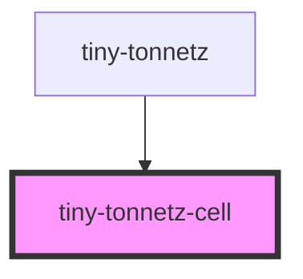

# tiny-tonnetz-cell

<!-- Auto Generated Below -->

## Properties

| Property       | Attribute        | Description | Type      | Default     |
| -------------- | ---------------- | ----------- | --------- | ----------- |
| `height`       | `height`         |             | `number`  | `undefined` |
| `primary`      | `primary`        |             | `boolean` | `false`     |
| `semiToneCode` | `semi-tone-code` |             | `number`  | `0`         |
| `width`        | `width`          |             | `number`  | `undefined` |

## Dependencies

### Used by

 - [tiny-tonnetz](../tiny-tonnetz)

### Graph

----------------------------------------------

*Built with [StencilJS](https://stenciljs.com/)*
