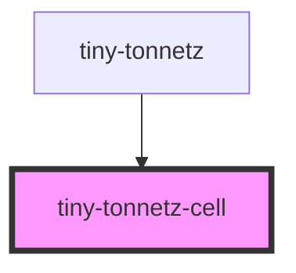

# tiny-tonnetz-cell

<!-- Auto Generated Below -->

## Properties

| Property       | Attribute        | Description | Type                                                                                                                                                    | Default     |
| -------------- | ---------------- | ----------- | ------------------------------------------------------------------------------------------------------------------------------------------------------- | ----------- |
| `activeNotes`  | --               |             | `{ 0: Note[]; 1: Note[]; 2: Note[]; 3: Note[]; 4: Note[]; 5: Note[]; 6: Note[]; 7: Note[]; 8: Note[]; 9: Note[]; 10: Note[]; 11: Note[]; 12: Note[]; }` | `undefined` |
| `height`       | `height`         |             | `number`                                                                                                                                                | `undefined` |
| `semiToneCode` | `semi-tone-code` |             | `0 \| 1 \| 10 \| 11 \| 12 \| 2 \| 3 \| 4 \| 5 \| 6 \| 7 \| 8 \| 9`                                                                                      | `0`         |
| `width`        | `width`          |             | `number`                                                                                                                                                | `undefined` |

## Dependencies

### Used by

 - [tiny-tonnetz](../tiny-tonnetz)

### Graph

----------------------------------------------

*Built with [StencilJS](https://stenciljs.com/)*
