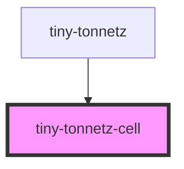

# tiny-tonnetz-cell

<!-- Auto Generated Below -->

## Properties

| Property               | Attribute                | Description | Type                                                           | Default                         |
| ---------------------- | ------------------------ | ----------- | -------------------------------------------------------------- | ------------------------------- |
| `cellStates`           | `cell-states`            |             | `any`                                                          | `undefined`                     |
| `height`               | `height`                 |             | `number`                                                       | `undefined`                     |
| `noteNamingConvention` | `note-naming-convention` |             | `NoteNamingConventions.ENGLISH \| NoteNamingConventions.LATIN` | `NoteNamingConventions.ENGLISH` |
| `semiToneCode`         | `semi-tone-code`         |             | `0 \| 1 \| 10 \| 11 \| 2 \| 3 \| 4 \| 5 \| 6 \| 7 \| 8 \| 9`   | `0`                             |
| `width`                | `width`                  |             | `number`                                                       | `undefined`                     |

## Dependencies

### Used by

 - [tiny-tonnetz](../tiny-tonnetz)

### Graph

----------------------------------------------

*Built with [StencilJS](https://stenciljs.com/)*
