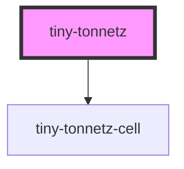

# tiny-tonnetz

<!-- Auto Generated Below -->

## Properties

| Property               | Attribute                | Description | Type                                                                                                                                                    | Default             |
| ---------------------- | ------------------------ | ----------- | ------------------------------------------------------------------------------------------------------------------------------------------------------- | ------------------- |
| `activeNotes`          | --                       |             | `{ 0: Note[]; 1: Note[]; 2: Note[]; 3: Note[]; 4: Note[]; 5: Note[]; 6: Note[]; 7: Note[]; 8: Note[]; 9: Note[]; 10: Note[]; 11: Note[]; 12: Note[]; }` | `{} as ActiveNotes` |
| `centralClusterMargin` | `central-cluster-margin` |             | `number`                                                                                                                                                | `1`                 |
| `isScaleSliderVisible` | `scale-slider`           |             | `boolean`                                                                                                                                               | `false`             |
| `isScalingEnabled`     | `scaling`                |             | `boolean`                                                                                                                                               | `true`              |
| `scale`                | `scale`                  |             | `number`                                                                                                                                                | `1`                 |

## Dependencies

### Depends on

- [tiny-tonnetz-cell](../tiny-tonnetz-cell)

### Graph

----------------------------------------------

*Built with [StencilJS](https://stenciljs.com/)*
