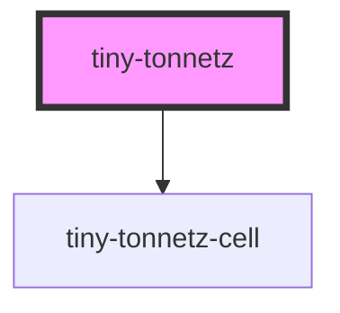

# tiny-tonnetz

<!-- Auto Generated Below -->

## Properties

| Property                      | Attribute                | Description | Type                                                                                                                                                                                        | Default                                                                     |
| ----------------------------- | ------------------------ | ----------- | ------------------------------------------------------------------------------------------------------------------------------------------------------------------------------------------- | --------------------------------------------------------------------------- |
| `activeNotes`                 | --                       |             | `{ 0?: NoteKey[]; 1?: NoteKey[]; 2?: NoteKey[]; 3?: NoteKey[]; 4?: NoteKey[]; 5?: NoteKey[]; 6?: NoteKey[]; 7?: NoteKey[]; 8?: NoteKey[]; 9?: NoteKey[]; 10?: NoteKey[]; 11?: NoteKey[]; }` | `{}`                                                                        |
| `centralClusterMargin`        | `central-cluster-margin` |             | `number`                                                                                                                                                                                    | `1`                                                                         |
| `isDarkTheme`                 | `force-dark-theme`       |             | `boolean`                                                                                                                                                                                   | `false`                                                                     |
| `isLightTheme`                | `force-light-theme`      |             | `boolean`                                                                                                                                                                                   | `false`                                                                     |
| `isScalingEnabled`            | `scaling`                |             | `boolean`                                                                                                                                                                                   | `true`                                                                      |
| `isTracing`                   | `trace`                  |             | `boolean`                                                                                                                                                                                   | `false`                                                                     |
| `isTracingPlayedNote`         | `trace-played-notes`     |             | `boolean`                                                                                                                                                                                   | `false`                                                                     |
| `isVersionVisible`            | `version`                |             | `boolean`                                                                                                                                                                                   | `false`                                                                     |
| `iscontrolsVisible`           | `controls`               |             | `boolean`                                                                                                                                                                                   | `true`                                                                      |
| `noteNamingConvention`        | `note-naming-convention` |             | `NoteNamingConventions.ENGLISH \| NoteNamingConventions.LATIN`                                                                                                                              | `NoteNamingConventions.ENGLISH`                                             |
| `noteNamingConventionOptions` | --                       |             | `NoteNamingConventions[]`                                                                                                                                                                   | `[     NoteNamingConventions.ENGLISH,     NoteNamingConventions.LATIN,   ]` |
| `scale`                       | `scale`                  |             | `number`                                                                                                                                                                                    | `1`                                                                         |

## Dependencies

### Depends on

- [tiny-tonnetz-cell](../tiny-tonnetz-cell)

### Graph

----------------------------------------------

*Built with [StencilJS](https://stenciljs.com/)*
